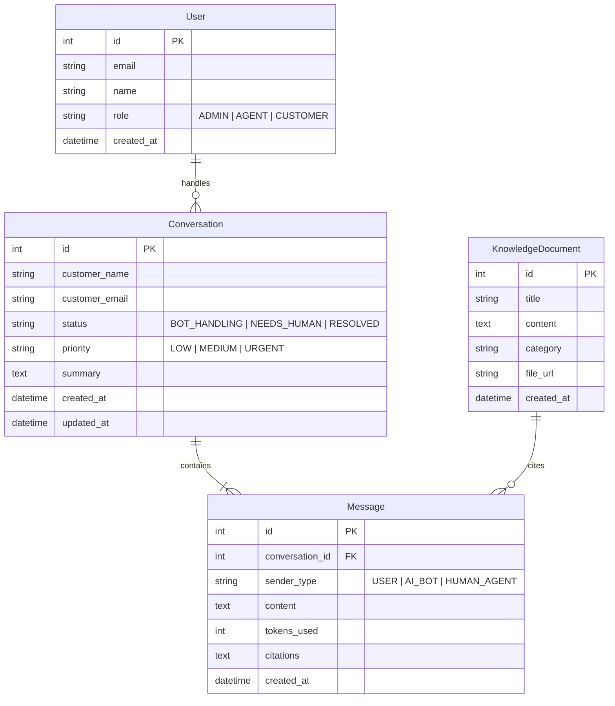

# 🛡️ OmniSupport AI — Enterprise AI Support & Knowledge Copilot

[](https://fastapi.tiangolo.com)
[](https://reactjs.org)
[](https://www.typescriptlang.org)
[](https://tailwindcss.com)
[](https://ai.google.dev)
[](https://opensource.org/licenses/MIT)

> An enterprise-grade, production-ready AI Customer Support & Knowledge Copilot platform inspired by **Intercom AI** and **Zendesk Copilot**.

---

## 🌟 Core Feature Highlights

### 1. ⚡ Token-by-Token AI Streaming (Customer Widget)
- **Zero-Latency Streaming:** Answers stream smoothly token-by-token using **Server-Sent Events (SSE)** via FastAPI.
- **Rich Markdown & Code Rendering:** Formats lists, bold text, blockquotes, tables, and includes syntax-highlighted code blocks with 1-click clipboard copy.
- **Interactive Preset Scenarios:** Pre-loaded quick actions to immediately test billing queries, webhook configurations, and error diagnostics.

### 2. 📚 Document-Aware AI (Context Injection & RAG)
- **Knowledge Base Grounding:** Searches the `KnowledgeDocument` relational repository dynamically.
- **Verified Citations:** Grounded snippets are injected into the prompt and verified citations (e.g., `[Doc #1: Billing & Refund Policy]`) are attached to responses.
- **Interactive RAG Sandbox:** Support admins can test query relevance scores and citation generation in real time from the Knowledge Base view.

### 3. 🚨 Smart Human Escalation & Live Agent Desk
- **Sentiment & Intent Detection:** Automatically detects customer frustration or explicit escalation keywords (*"human", "representative", "manager", "dispute"*).
- **Instant AI Incident Summaries:** Generates concise 1-sentence issue digests for support engineers.
- **Real-Time Human Takeover:** Agents can respond directly inside the conversation thread and resolve tickets with 1-click.

### 4. 📊 Executive Analytics & KPI Telemetry
- **Containment Metrics:** Live resolution rate (`78.4%+`), average AI response streaming time (`1.35s`), and human escalation counts.
- **Visual Activity Charts:** 7-day query timeline (AI Resolved vs Escalated) and top-queried category distributions.

### 5. 🎯 Recruiter 1-Click Interactive Demo Mode
- **Test Customer Chatbot:** Instant access to customer streaming chat with suggested prompt chips.
- **Explore Agent Dashboard:** Instant login as Support Lead with pre-populated tickets across statuses (`NEEDS_HUMAN`, `BOT_HANDLING`, `RESOLVED`).

---

## 🏗️ Architecture & Database Schema

```
OmniSupport AI/
├── backend/
│   ├── config.py                 # Pydantic Settings & Gemini API config
│   ├── database.py               # SQLAlchemy SQLite/PostgreSQL connection engine
│   ├── models.py                 # Database Models (User, KnowledgeDocument, Conversation, Message)
│   ├── schemas.py                # Pydantic Schemas for type validation
│   ├── seed_data.py              # Realistic enterprise SaaS seed data
│   ├── test_api.py               # Pytest automated test suite
│   ├── requirements.txt          # Python dependencies
│   ├── Dockerfile                # Production containerization
│   ├── render.yaml               # Render cloud deployment blueprint
│   ├── services/
│   │   ├── rag_service.py        # Keyword & vector similarity scoring with citations
│   │   └── ai_service.py         # Gemini streaming client + fallback simulator
│   ├── routers/
│   │   ├── chat.py               # POST /api/chat/stream (SSE streaming)
│   │   ├── documents.py          # CRUD endpoints for Knowledge Base articles
│   │   ├── tickets.py            # Ticket queue, human replies, resolve status
│   │   └── analytics.py          # KPI metrics & volume analytics
│   └── main.py                   # FastAPI application entrypoint & auto-seeding
│
└── frontend/
    ├── src/
    │   ├── types/index.ts        # TypeScript interfaces matching backend models
    │   ├── services/api.ts       # REST client with environment routing
    │   ├── hooks/
    │   │   └── useChatStream.ts  # Robust Server-Sent Events (SSE) streaming hook
    │   ├── components/
    │   │   ├── Navbar.tsx        # Top navigation with live backend status indicator
    │   │   ├── RecruiterBanner.tsx # 1-Click Recruiter scenario presets
    │   │   ├── LandingPage.tsx   # SaaS landing page with interactive embed
    │   │   ├── ChatWidget/       # Customer streaming widget & Markdown renderer
    │   │   ├── AgentWorkspace/   # Live support desk with Copilot summaries & replies
    │   │   ├── KnowledgeBase/    # RAG document manager & similarity tester
    │   │   └── Analytics/        # Executive KPI telemetry & volume charts
    │   ├── App.tsx               # Root view router
    │   └── main.tsx              # React mounting
    ├── vercel.json               # Vercel SPA routing config
    └── vite.config.ts            # Vite proxy & build config
```

### Relational Database Schema



---

## 🚀 Quickstart & Local Development

### 1. Prerequisites
- **Python 3.10+**
- **Node.js 18+** & `npm`

### 2. Backend Setup
```bash
cd backend

# 1. Install dependencies
pip install -r requirements.txt

# 2. (Optional) Set your Gemini API key in .env or run with intelligent fallback engine:
# cp .env.example .env
# GEMINI_API_KEY="your_gemini_api_key_here"

# 3. Seed database with realistic tickets and documents
python seed_data.py

# 4. Start FastAPI server
uvicorn main:app --reload --port 8000
```
Backend will be live at `http://localhost:8000` (Interactive API docs at `http://localhost:8000/docs`).

### 3. Frontend Setup
```bash
cd frontend

# 1. Install dependencies
npm install

# 2. Run Vite dev server
npm run dev
```
Frontend will be live at `http://localhost:5173`.

### 4. Run Automated Backend Tests
```bash
cd backend
python -m pytest test_api.py -v
```

---

## 🌐 Production Deployment Guide

### Deploy Backend to Render

1. Create a new **Web Service** on [Render](https://render.com).
2. Connect your GitHub repository.
3. Configure the settings:
   - **Root Directory:** `backend`
   - **Environment:** `Python 3`
   - **Build Command:** `pip install -r requirements.txt`
   - **Start Command:** `uvicorn main:app --host 0.0.0.0 --port $PORT`
4. Add Environment Variables:
   - `GEMINI_API_KEY`: *(Your Google Gemini API Key)*
   - `GEMINI_MODEL`: `gemini-2.5-flash`
   - `DATABASE_URL`: *(Leave blank for SQLite, or connect a Render PostgreSQL instance)*

---

### Deploy Frontend to Vercel

1. Import your project into [Vercel](https://vercel.com).
2. Set the **Root Directory** to `frontend`.
3. Framework Preset: **Vite**.
4. Add Environment Variable:
   - `VITE_API_URL`: `https://your-backend-name.onrender.com/api`
5. Click **Deploy**. The `vercel.json` file handles all client-side SPA routing automatically.

---

## 📡 API Specification

| Endpoint | Method | Description |
|---|---|---|
| `/api/chat/stream` | `POST` | SSE real-time token streaming with RAG lookup & handoff detection |
| `/api/documents` | `GET` | List knowledge documents (supports `category` & `search`) |
| `/api/documents` | `POST` | Create a new knowledge document & index for RAG |
| `/api/documents/{id}` | `DELETE` | Remove document from knowledge base |
| `/api/documents/rag/search-preview` | `GET` | Test RAG similarity scoring & citation retrieval |
| `/api/tickets` | `GET` | List all tickets with status, priority, and last messages |
| `/api/tickets/{id}/messages` | `GET` | Retrieve complete message history for a ticket |
| `/api/tickets/{id}/reply` | `POST` | Live human agent submits a reply to the customer |
| `/api/tickets/{id}/resolve` | `POST` | Mark ticket as RESOLVED |
| `/api/tickets/{id}/status` | `PATCH` | Update ticket status and priority |
| `/api/analytics` | `GET` | Fetch resolution rates, response latencies, and query charts |

---

## 👨‍💻 Candidate Portfolio Highlights

- **Full-Stack Proficiency:** Modern FastAPI asynchronous backend architecture paired with React 18+ and TypeScript strict typing.
- **Production AI Engineering:** Server-Sent Events (SSE) streaming protocols, dynamic RAG context retrieval, source attribution, and automated intent classification.
- **Enterprise Design System:** Tailored UI with dark glassmorphism, responsive ticket queues, accessible inputs, and syntax highlighting.
